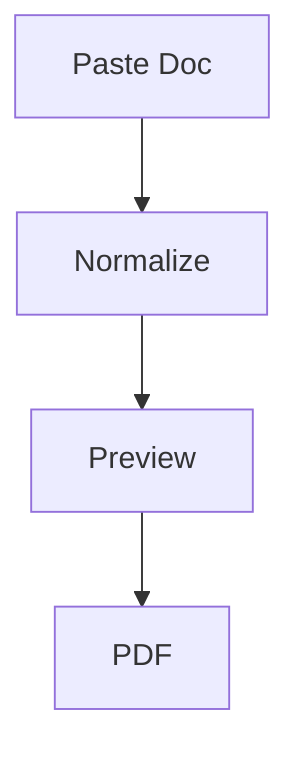

# Manual Formatting Stress Test

This document is used to verify the **Edit Preview tools**, **normalizer**, **preview**, and **PDF export** pipeline.

---

## 1) Code Formatting Targets

### 1.1 Plain code block target

Select the block below and apply **Code Block**.

npm run lint

npm run build

docker compose up --build -d

Expected after formatting:

- it should become a fenced code block

- preview should show a codecard

- PDF should preserve it as a code block

---

### 1.2 Another plain code block target

Select the block below and apply **Code Block**.

function add(a, b) {

  return a + b;

}

console.log(add(2, 3));

Expected:

- should become a fenced code block

- should render as codecard in preview

- PDF should keep syntax formatting

---

### 1.3 Inline code target

Select only the command and apply **Inline Code**.

npm install

Expected:

- should become `npm install`

- should remain inline inside the paragraph

---

### 1.4 Mixed command block with comment

Select the entire block and apply **Code Block**.

npm run lint

# run validation

npm run build

docker compose down

Expected:

- `# run validation` stays inside the code block

- comment must not turn into heading

---

## 2) Heading Actions

Select each of these lines and apply different heading actions.

This should become H2 heading

This should become H3 heading

This should become H4 heading

Expected:

- only the selected line becomes heading

- surrounding text remains unchanged

---

## 3) Quote Actions

Select both lines and apply **Blockquote**.

This should become quote line one.

This should become quote line two.

Expected:

- lines become quote block

---

## 4) List Actions

### 4.1 Bullet list target

Select these lines and apply **Bullet List**.

Alpha

Beta

Gamma

Expected:

- Alpha

- Beta

- Gamma

---

### 4.2 Numbered list target

Select these lines and apply **Numbered List**.

Step one

Step two

Step three

Expected:

1. Step one

2. Step two

3. Step three

---

### 4.3 Mixed list conversion

Select the block and apply **Bullet List**.

Apple

Banana

Cherry

Dragonfruit

Expected:

- clean bullet list

- no mixed numbering

---

## 5) Existing Smart Structures (must remain correct)

### 5.1 Callouts

Note: This is a NOTE callout.

Tip: This is a TIP callout.

Warning: This is a WARNING callout.

Important: This is IMPORTANT.

Expected:

- callout styling remains

- manual formatting elsewhere must not break these

---

### 5.2 Procedures

Steps:

1. Open Edit Preview

2. Select content

3. Apply formatting

4. Save changes

Workflow:

1. Paste document

2. Edit structure

3. Save

4. Export

Expected:

- procedure blocks render correctly

---

### 5.3 Commands block (auto-fencing test)

Commands:

npm run lint

# this must stay a comment inside the code block

docker compose down

Expected:

- automatically fenced code block

- comment preserved

---

## 6) Tables

### 6.1 Markdown table

| Feature | Expected |

|---|---|

| Tables | Render correctly |

| Code | Syntax highlighted |

| Mermaid | SVG diagram |

---

### 6.2 Spacing table

Name     Score     Notes

Alpha    98        Excellent

Beta     84        Good

Gamma    75        Needs review

Expected:

- auto-converted table

---

### 6.3 Wrapped table

Category              Questions to answer                         Notes

Payments              payout methods; bank account availability   delays can kill momentum

Compliance            invoices; taxes; disclaimers                avoid restrictions

Expected:

- wrapped table converted correctly

---

## 7) Mermaid Diagrams

### 7.1 Fenced mermaid

Expected:

- rendered SVG diagram

---

### 7.2 Unfenced mermaid

graph LR

  X[User] --> Y[Edit]

  Y --> Z[Export]

Expected:

- normalizer auto-fences it

- preview renders diagram

---

## 8) ASCII Diagram

+------------------+

| Paste Content    |

+------------------+

         |

         v

+------------------+

| Normalize + AST  |

+------------------+

         |

         v

+------------------+

| PDF Export       |

+------------------+

Expected:

- preserved layout

- not converted to table

---

## 9) Combined Manual Edit Zone

Everything below starts intentionally plain.

this line should become h3

quote this line one

quote this line two

convert these to bullets

item a

item b

item c

convert these to numbers

first

second

third

make this a code block

docker compose up --build -d

npm run lint

npm run build

make only this inline code: pnpm install

---

## 10) End Marker

If everything works correctly:

- code block action creates fenced block

- inline code wraps selection

- headings apply correctly

- quote/list actions work

- callouts and procedures remain correct

- commands block auto-fences

- tables convert properly

- mermaid renders

- PDF matches preview

Then the pipeline is validated.
