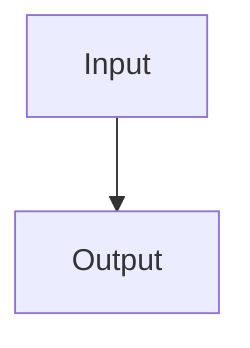

# Document Intelligence Validation

## Code Section

```bash
npm run lint
docker compose down
```

## Notes

Note: This is a note.
Tip: This is a tip.
Warning: This is a warning.

## Procedures

Steps:

1. Open app
2. Paste text
3. Generate PDF

Workflow:

1. Parse
2. Render
3. Export

## Tables

Name     Score
Alpha    98
Beta     84

## Diagram



## Plan

Phase 1
Build parser

Step 2
Add UI

Expected intelligence:

- title: `Document Intelligence Validation`
- headings > 0
- commandBlocks = 1
- tables = 1
- diagrams = 1
- procedures = 2
- callouts = 3
- roadmaps = 2 (`Phase 1`, `Step 2`)
